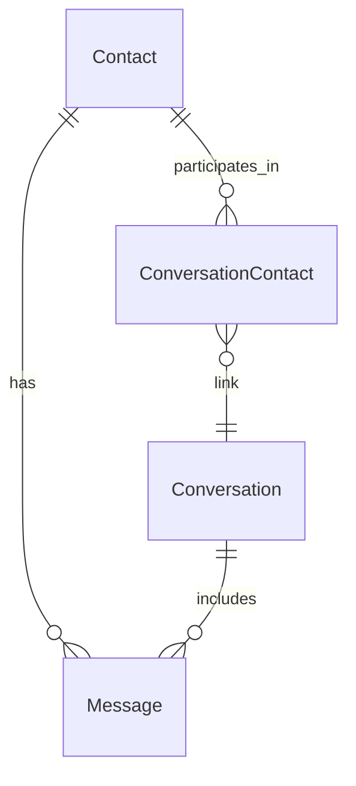

# iMessage Insights – Requirements Document

## 1. Purpose & Scope
Build a lightweight macOS desktop app that surfaces fun, privacy‑first analytics about a user's iMessage history. Core questions:
- Who do I text the most?
- How does my messaging volume change over time?
- Which contacts take (or make) the longest to reply?
- Emoji usage, activity rhythms, engagement habits, and daily streaks.

## 2. Target Audience
- macOS users curious about their texting habits
- Privacy‑conscious power users who enjoy quantified‑self dashboards

## 3. Core Value Proposition
Deliver immediate, visually compelling insights from local Messages data without requiring any cloud sync or account signup.

## 4. Functional Requirements

| ID | Requirement |
|----|-------------|
| FR‑1 | Detect and request Full Disk Access, locate ~/Library/Messages/chat.db, and copy it to a read‑only temp location |
| FR‑2 | Parse SQLite tables (message, handle, chat, attachment) into an internal data model |
| FR‑3 | Compute per‑contact message counts (sent, received, total) |
| FR‑4 | Compute response‑time stats per contact (avg, median, P95) |
| FR‑5 | Aggregate message counts into daily buckets for timeline charts |
| FR‑6 | Render a dashboard summarizing Top Contacts, Message Trends, and Slowest Responders |
| FR‑7 | Drill‑down view for each contact with detailed stats and mini‑charts |
| FR‑8 | Export selected charts as PNG and raw stats as CSV |
| FR‑9 | Local‑only processing with an in‑app "Delete All Data" button |
| FR‑10 | Auto‑refresh stats when user clicks "Sync Latest" |
| FR‑11 | Compute and display Emoji MVPs – top‑10 emojis overall and per contact |
| FR‑12 | Generate Night‑Owl vs Early‑Bird Index – hourly histogram for user vs. each contact |
| FR‑13 | Calculate Self‑Response Speed per contact (user's avg/median reply time) |
| FR‑14 | Derive Group‑Chat Engagement Score – user message share (%) per group chat |
| FR‑15 | Build Day‑of‑Week Hotspots – peak weekday of activity per contact |
| FR‑16 | Detect Daily Streak Lengths – longest consecutive‑day stretch with ≥ 1 message exchanged per conversation |

## 5. Non‑Functional Requirements
- **Performance**: Initial analysis completes on 100k messages in <10 s on M1 MacBook Air
- **Privacy**: No network calls; all data stays on device
- **Usability**: Zero‑state onboarding + clear permission guidance
- **Accessibility**: VoiceOver labels, dynamic type, high‑contrast friendly palettes
- **Maintainability**: Modular, testable Swift packages

## 6. Technical Stack
- **Platform**: macOS 13 Ventura+
- **Language**: Swift 5.9
- **UI Framework**: SwiftUI + SF Symbols + Charts framework
- **Data Layer**: SQLite.swift (read‑only) or GRDB
- **State Management**: SwiftData or Combine
- **Packaging**: Notarized .dmg (outside Mac App Store due to private APIs)

## 7. Data Model (simplified)

Key fields: contactId, isFromMe, date, text, conversationId

## 8. Metrics & Algorithms

### Message Volume
- `COUNT(*)` per contact

### Response Time (Contact → Me)
- For each incoming msg, find next outgoing msg in same chat; exclude gaps >72 h

### Self‑Response Speed (Me → Contact)
- Mirror of above with sender reversed

### Timeline
- Group by `date/86400` then `SUM`

### Emoji MVPs
- Tally emoji code points; sort descending (filter skin‑tone variants)

### Night‑Owl / Early‑Bird Index
- Histogram messages by hour (0‑23); compare user vs. contact peak hour; classify >22:00 as night‑owl, <06:00 as early‑bird

### Group‑Chat Engagement Score
- `(messages_from_me / total_messages_in_chat) × 100`

### Day‑of‑Week Hotspots
- Bucket messages by weekday (Mon‑Sun); highlight modal weekday per contact

### Daily Streak Length
- Compute longest run where `DATEDIFF(day) = 1` between successive message‑days within a conversation

## 9. UI/UX Outline

### Onboarding Screen
- Permission steps → "Begin Scan"

### Loading/Progress View
- Progress bar, fun facts

### Dashboard (cards + charts)
- Top Contacts
- Message Timeline
- Slowest Responders
- Emoji MVPs (word‑cloud style grid)
- Hourly Activity Dial (24‑segment radial chart)
- Daily Streak Badge (current streak + record)

### Contact Detail View
- Personal emoji top‑5
- Response‑time scatterplot (me vs. them)
- Day‑of‑Week heatmap
- Group‑chat engagement (if applicable)

### Settings
- Data refresh, delete, theme toggle

## 10. Security & Privacy
- Only reads user's local Messages DB after explicit consent
- Runs entirely offline
- Signed & notarized to avoid "unidentified developer" gatekeeper issues

## 11. Assumptions & Constraints
- User grants Full Disk Access
- Messages app uses the standard chat.db schema
- App distributed outside Mac App Store; sandboxing disabled

## 12. Out‑of‑Scope
- iCloud Messages sync analysis across multiple devices
- Sentiment/emotion or advanced NLP content analysis
- iOS companion app

## 13. Future Ideas
- Streaks gamification (badges, shareable trophies)
- Sentiment trendlines (positive/negative emoji ratios)
- Cross‑device merge via iCloud Drive
- Opt‑in ML keyword search

## 14. Risks & Mitigations

| Risk | Mitigation |
|------|------------|
| Heavy emoji parsing slows analysis | Pre‑compute emoji set, use C‑level scanning |
| Hour‑level histograms spike memory | Streamed accumulator array, not per‑message objects |
| User confusion over permissions | In‑app video/gif walkthrough |

## 15. Success Metrics
- Time to first insight < 30 s
- 80% of users complete onboarding
- NPS ≥ 40 among early testers